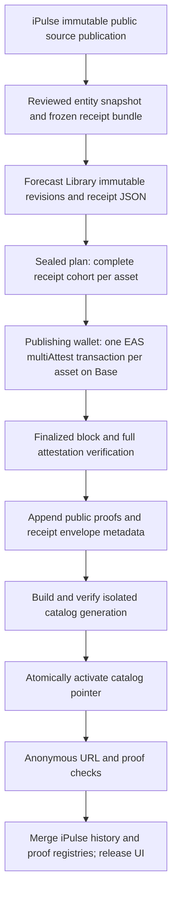

# Forecast Library publication operating guide

This is the canonical end-to-end operating guide: source eligibility, frozen
receipts, Library publication, Base proof issuance, catalog activation, iPulse AI
links, verification and recovery. Older dated release notes are evidence, not
alternative instructions. Run commands from this repository root with Node 22+.

## Current Batch 6 execution state - 12 September 2026

- Production already contains 4,511 public receipts for 376 forecast subjects.
- The reviewed Showcase is PepsiCo, NVIDIA, Bitcoin, Alphabet and SPY: **all 12
  original forecasts per asset, 60 receipts total**. Do not select by outcome.
- Fresh read-only preparation validated all 60 payload hashes and projections.
  All 180 canonical-page, short-link and receipt-JSON checks passed.
- `publication/batch-6.json` proposes **Base mainnet, chain 8453**. This config
  is not a signed approval or evidence of issuance. Confirm the production
  network and publishing wallet before signing. Base Sepolia, chain 84532, is
  the test network and must be labelled as such.
- The OFR schema was absent on Base mainnet at preparation. Initial publication
  therefore needs **one schema registration + five asset submissions**, yielding
  60 independent EAS UIDs. Later batches reuse the registered schema.
- The owner signed schema registration and all five asset transactions on
  12 September 2026 using publishing wallet
  `0xe30763d80052C83646a44ef58DFC1489f7F81788`. All five succeeded with 12
  attestation events each. All 60 attestations passed finalized verification in
  production and staging. Both catalogs are active and all 180 public URL/proof
  checks passed in each environment. The iPulse proof-link release (`fcd945ed`,
  promoted through PR 646 as `dea1d059`) is deployed to staging and production.
  Both passed live acceptance for all five ledgers, 60 individual proof links,
  five shared transaction links and the updated methodology page.
  The run's `signing-journal.json` preserves every transaction hash; never resend.
- Total network fees for all six transactions: `0.000451181271351734 ETH`.
  Remaining publishing balance immediately afterward: `0.007048818728648266 ETH`.
- Verified catalog generations: production
  `ipulse-batch-6-showcase-proofs-1789212015268`; staging
  `ipulse-batch-6-showcase-proofs-1789211847882`. Prior generations are retained.
- Evidence: `architecture_and_operations/backups/forecast-publication-2026-09-12`
  in the Future Edge workspace contains signed plans, journals, verified
  registries, catalog checkpoints and live acceptance reports. All 4,511 iPulse
  history links were preserved. Local verification passed 142 OFR tests,
  TypeScript and seven iPulse receipt/ledger tests. Both iPulse cloud builds and
  rollouts succeeded; local full builds timed out on page-data reads.
- The iPulse repository's pre-existing security scan baseline is unchanged:
  223 historical secret candidates and three code findings, with no new
  findings from this release. These are not resolved by blockchain publication;
  no scanner suppression or protection changes were made.

| Submission | Base transaction |
| --- | --- |
| Schema | `0xd9300b70871b1d0fb6726eee1cadf2eabbc2b36d1a7b91d10b215a3a14a76076` |
| PepsiCo | `0xa6d3980ca5d1c67d2deba1c38010966c118dc8b371afb7a8ff74ac032bd046b1` |
| NVIDIA | `0x52a45ec94c45b4596012a69f1848da628f5eee9d1ba630dda84688a168cbb202` |
| Bitcoin | `0x7d0063f86ba913f4e29b3d51c48237be8a829702a3a900e64c1fae81843e7b3b` |
| Alphabet | `0x17575c0be8e42cda1550064239a34bc578d541b4c7f16c5797408d57c1cd66ed` |
| SPY | `0x131d1e8ae2e8dcf5cc4b1e3acce3575f20f9c3cc128e621a3f22ab1a7f15aecf` |

## Architecture and guarantees



**Identity:** one forecast revision, one receipt payload, one SHA-256 digest,
one permanent forecast ID, and one EAS attestation UID. All individual
attestations for an asset and batch share one transaction; they do not become
one aggregate forecast.
All-or-nothing execution of that transaction prevents partial per-asset issuance.

**Variable cohort size:** 12 is the Batch 6 Showcase count, not a schema or
workflow limit. Each asset declares its own `expectedReceipts` in the publication
configuration: 10, 15 or another complete reviewed count. Counts may differ
between assets and batches. The same code creates one transaction containing
exactly that asset's receipts and verifies the matching number of attestations.
Gas simulation must succeed for the complete transaction; an oversized cohort
stops for review rather than silently dropping forecasts or splitting it.

**Sealing:** canonicalize `receiptPayload` using RFC 8785, then SHA-256 it.
The versioned OFR JSON Schema validates the document. The compact market
projection contains identity, timestamps, target/unit, anchor, classification,
path, retrospective flag and digest. Full JSON stays in Forecast Library;
Base stores the compact evidence, not the full receipt or private source data.
The current executable adapter supports the OFR v0.1 market profile. Other
human, statistical or domain profiles need their own reviewed projection;
they must not be forced into a financial-market schema.

**Meaning:** an anchor proves the exact digest existed by its actual blockchain
time. It does not prove forecast accuracy, authorship, or an earlier forecast
creation date. Batch 6 issuance is retrospective. A changed forecast requires a
new revision and explicit correction lineage, never edits to its old payload.

**Contracts:** EAS `0x4200000000000000000000000000000000000021`;
SchemaRegistry `0x4200000000000000000000000000000000000020`.
The non-revocable schema UID is
`0xfef3868c279700c5312e68d8f5be4cd4a755a5125c3d2153f1970b626e35cc14`.
The exact schema and ABI inputs live in `src/data/eas-base-sepolia.json`; the
historical filename does not select the execution network. Configuration binds
the plan and RPC to the chosen chain. Recipient, resolver and reference UID are
zero; expiry and transaction value are zero. Network gas fees still apply.

## Storage and durable links

| Firestore path | Role and mutation policy |
| --- | --- |
| `entities`, `entity_versions`, identity/relationship collections | Governed subjects; reuse exact existing entity IDs, append historical versions |
| `public_entities/{entityId}` | Current public subject metadata |
| `public_forecast_revisions/{forecastPublicId}` | Immutable individual forecast publication |
| `public_receipts/{digest}` | Sealed `document.receiptPayload`; appendable `proofEnvelope` and proof projection metadata |
| `public_forecast_resolvers/{forecastPublicId}` | Permanent forecast-to-canonical-path binding |
| `public_receipt_resolvers/{digest}` | Permanent digest-to-forecast binding |
| `proof_jobs/{jobId}` | Publication request metadata; not evidence of an issued proof |
| `public_proofs/{caip2}__{attestationUID}` | Append-only verified onchain proof record |
| `public_catalog_generations/{id}/...` | Isolated derived browsing catalogs, verified before exposure |
| `public_catalog_state/current` | Active and previous generation IDs; compare-and-swap activation |

`/forecasts/{forecastPublicId}` and the stored `canonicalPath` return the forecast
directly, without redirects. `/api/v1/receipts/{digest}` returns its JSON.
New branding, categories or UI layouts must not rewrite existing resolver paths.
Catalogs overlay verified proof metadata without altering frozen forecast rows.
An active generation is retained for recovery; never rebuild in place.

## One repeatable command entry point

```sh
npm run publication -- status --config=publication/batch-6.json
```

Default run directory:
`.publication-runs/{runId}-{projectId}-{chainId}/` (ignored by Git).
Use `--directory=/absolute/path` consistently to override it. Archive the entire
run directory in the operations backup area. Never delete a signing journal to
make a run appear new. Do not put private keys, wallet seeds or credentials in
configuration, run artifacts, source control or chat.

The run directory holds frozen entity/receipt bundles and seals, `plan.json`,
`signing-journal.json`, `signed-transactions.json`, `verified-proofs.json`,
publication checkpoints, catalog generation checkpoints, iPulse exports and
`public-verification.json`. A status command reports artifact presence; existence
of a plan or verification file alone does not establish production completion.

Prerequisites: existing Google Application Default Credentials with the intended
read/write access; `bq` for new iPulse imports; a browser wallet (including a
hardware wallet exposed through an EIP-1193 extension) with ETH on the chosen Base
network; and the reviewed **public** attester address. No server-side signing key
is needed. Each wallet request shows its fee and requires the owner's signature.
A mainnet plan does not spend funds merely by being prepared or opened.

### Publishing wallet and funding

Use the dedicated ForecastLibrary wallet, not an everyday personal spending
wallet. The current public address is
`0xe30763d80052C83646a44ef58DFC1489f7F81788`. Recovery material stays with the
owner; do not export it to this repository or the publication runner.

Fund it with native ETH on Base mainnet (8453). ETH on Ethereum or another
network must first be bridged to Base or withdrawn on Base; changing the wallet's
selected network alone does not move funds. The owner reviews transfers and
bridge fees in their wallet. Compare the complete destination address against
the publishing wallet's Receive screen. Keep enough gas in the sending wallet.

The first funding was 0.0075 ETH. Funding is a reserve, not a guaranteed number
of future batches: transaction sizes, gas prices and ETH prices vary. Each
submission transfers zero ETH to EAS but spends network fees. No automatic
top-ups, token allowances or unattended private-key signing are part of this
workflow.

The signing page's `127.0.0.1` origin is a loopback server on the operator's
computer. Its random session token, Host and Origin checks restrict local API
access; the wallet still requires separate transaction approval. A future
authenticated admin dashboard can reuse the sealed plans and verifier, with
durable background jobs. That hosted dashboard is not yet deployed, and the
current post-signing `run --apply` step remains an operator command.

## A. Existing Batch 6: publication and recovery reference

Do not re-import, reseal or issue Batch 6 again. It is already public and its
five mainnet transactions are recorded above. The commands below document the
execution sequence and recovery entry points; a completed run needs no further
wallet approvals. Use section B for a genuinely new eligible batch.

```sh
npm run publication -- prepare --config=publication/batch-6.json
npm run publication -- smoke --config=publication/batch-6.json
npm run publication -- sign --config=publication/batch-6.json --attester=0xYOUR_PUBLIC_WALLET
```

Preparation point-reads the published receipts, checks their schema, hashes,
identity, full projection and expected per-asset counts, then creates one sealed
plan. It reuses an unchanged existing plan on later runs. Changing configuration
requires a new reviewed preparation; **never prepare a replacement after signing
has begun**. The preparer refuses already-verified receipts on the same network.

Open the printed loopback URL in the browser containing the wallet extension.
Connect the exact attester address. The local page displays the chain, counts,
plan digest, destination and next asset. It offers schema registration only if
absent. After registration, each asset transaction is simulated via
`eth_estimateGas` before the signing prompt. Review the wallet's total fee,
including L1 data cost; a prior estimate is not a guaranteed fee budget. Sign
one request at a time. The journal is flushed to disk before sending; the next
asset is offered only after successful inclusion of the previous transaction.

The display label uses publisher, batch, original forecast date (or range),
receipt count and subject. It is derived from the sealed plan and is not a new
onchain field or a change to receipt bytes. A successful registration is checked
at its inclusion block if an earlier latest-state read did not yet see it.

When all hashes are recorded, stop the local signing server with Ctrl-C. Wait
until Base reports the transaction blocks as `finalized`, then run:

```sh
npm run publication -- verify --config=publication/batch-6.json
OFR_CONFIRM_FIRESTORE_PROJECT=oflapp-prod npm run publication -- run --config=publication/batch-6.json --apply --registry=/absolute/ipulse/src/data/forecast-library-proofs.json --history=/absolute/ipulse/src/data/forecast-library-history.json
```

`verify` reads chain and Firestore only. `run --apply` resumes checkpoints: it
re-verifies every planned transaction and attestation, appends proof metadata,
builds and verifies an isolated catalog, atomically activates it, checks public
URLs, then produces merged iPulse exports. It **never sends transactions**.
If finality is pending, rerun later with the same hashes. No fixed sleep or
number of L2 confirmations substitutes for the finalized block check.

The verifier checks chain, signer, EAS destination, exact calldata, success,
canonical block hash, finality, event count, all UID payloads, schema, timestamps,
zero recipient/refUID, non-revocability, no expiry/revocation, stored payload
hashes and permanent bindings. All chain proofs verify before any Firestore
write. Metadata writes are bounded to 100 receipts per Firestore transaction
(60 for this Showcase); interrupted larger runs resume idempotently. Catalog
activation waits for the complete cohort.

Attestation reads use one read-only Multicall per asset at the same finalized
block, and fail if any member cannot be read. Run production and staging
verification sequentially when using the public Base RPC to limit request
bursts. A rate-limit error is a verification interruption, never a reason to
resubmit a transaction or bypass finality.

## B. Next eligible batch: prepare once, publish, sign, resume

1. Copy the configuration to `publication/batch-N.json`. Set a unique `runId`,
   `scoringBatch`, matching `collectionId`, a **fixed actual receipt issuance
   timestamp**, target project and approved chain. Declare every Showcase asset
   by stable entity ID and its expected complete forecast count. Do not change
   the expected count to bypass an incomplete import.
2. Confirm the batch has passed iPulse's immutable **public** publication gate.
   Internal-only records are excluded; pre-Batch-6 records are rejected. The
   adapter reads public revision 1 where present and refuses ambiguous fallback
   revisions. It does not run models or create new predictions. Historical
   Batch 6 fixtures are used only for Batch 6.
3. For newly introduced assets, first update the reviewed public asset URL map
   (`src/data/ipulse-public-asset-paths.json`) from iPulse's authoritative published
   catalog. Never guess an asset URL. This map applies to the financial iPulse
   adapter, not to every domain of Forecast Library.
4. Freeze the entity snapshot and entire receipt publication bundle:

```sh
npm run publication -- prepare-library --config=publication/batch-N.json
npm run publication -- publish-library --config=publication/batch-N.json
```

Review `entity-plan.json`, `library-plan.json`, excluded records, source lineage,
counts, IDs, routes and `library-bundle-seal.json`. The second command is a dry
run. A new-batch source preparation can take time; normal reruns publish the
saved bundle and do not query a newer source snapshot.

5. Apply the reviewed Library publication and build its catalog:

```sh
OFR_CONFIRM_FIRESTORE_PROJECT=oflapp-prod npm run publication -- publish-library --config=publication/batch-N.json --apply
OFR_CONFIRM_FIRESTORE_PROJECT=oflapp-prod npm run publication -- catalog --config=publication/batch-N.json --apply
npm run publication -- prepare --config=publication/batch-N.json
npm run publication -- smoke --config=publication/batch-N.json
```

The entity plan is replayed from its reviewed snapshot, including historical
lifecycle transitions. Existing receipt identities are never overwritten.
The Library can be publicly browsable before optional blockchain issuance.

6. Run `sign` with the approved attester, then the same `run --apply` command
   from section A using `batch-N.json`. Subsequent runs skip completed steps and
   reuse the recorded transactions. Wallet approval is the intentional human
   step; publication after signing is one resumable command.

For non-iPulse support-led submissions, use the generic
`publish-library-bundle.mjs` validated bundle contract. Approve public rights and
identity, validate the supported profile and complete cohort, then follow the
same Library/catalog/proof gates. The current runner's batch configuration is
specifically the iPulse market adapter; broader-domain issuance is not claimed
as automatically supported.

## C. Staging, iPulse display and deployment

Use a separate configuration/run directory for staging (`oflapp-staging`).
Promote the **same** reviewed source bundle and entity plan; do not regenerate
payload timestamps or IDs. These commands enforce parity, without manually
editing plan seals or copying signing locks:

```sh
npm run publication -- adopt-library --config=publication/batch-N-staging.json --from=/absolute/reviewed-source-run
```

Publish and materialize that environment with its own configuration and project
confirmation. `adopt-library` allows only `projectId` to differ between source
and target configurations, and preserves the sealed source bundle and entities.
Batch 6 is already public in both environments, so skip this source adoption.

Onchain proof can be shared between environments; do not pay to issue it again.
Prepare the staging plan against its own public receipts, then adopt the
existing mainnet transaction hashes:

```sh
npm run publication -- prepare --config=publication/batch-6-staging.json
npm run publication -- adopt-signatures --config=publication/batch-6-staging.json --from=/absolute/signed-production-run
npm run publication -- verify --config=publication/batch-6-staging.json
OFR_CONFIRM_FIRESTORE_PROJECT=oflapp-staging npm run publication -- run --config=publication/batch-6-staging.json --apply
```

`adopt-signatures` requires exact identity, digest, permanent-path and calldata
parity before binding the manifest to the staging plan. It copies no catalog
checkpoints and never signs. Staging then independently verifies chain evidence
and its own stored payloads before appending proof metadata.

For a staging-only rehearsal use Base Sepolia and keep it labelled as testnet.
A Sepolia transaction is never mainnet evidence. Production should use the
approved mainnet cohort after the rehearsal, with its own signing journal.

`export-ipulse` merges the verified registry with the existing iPulse file,
retaining older batches and refusing same-network conflicts or mainnet-to-testnet
downgrades. `export-history` reads all published frozen forecasts in the batch
and merges their permanent IDs into the existing history index using the reviewed asset URL map and original publication keys. Both write **candidates in the run directory**, not an
unreviewed shared iPulse checkout:

```sh
npm run publication -- export-ipulse --config=publication/batch-N.json --registry=/absolute/ipulse/src/data/forecast-library-proofs.json
npm run publication -- export-history --config=publication/batch-N.json --history=/absolute/ipulse/src/data/forecast-library-history.json
```

Copy the reviewed candidates to iPulse's corresponding `src/data` files through
its existing release checkout. Its prebuild regenerates the compact
`forecast-library-catalog.json` discovery projection. Run its proof-link/history tests and build,
release to staging, inspect each Showcase asset's ledger, then promote staging
to main and verify production. Expect **one proof link per included forecast and one shared
transaction link per Showcase asset** (12 proof links for each current Batch 6
Showcase asset), with the actual network visible. Re-merge
from the latest registry if another release added records in the meantime.
Do not overwrite another task's uncommitted work or force-push.

### iPulse Firestore ledger evidence

After verified publication and history export, synchronize the verified Base
proof metadata into iPulse staging, then production. This step never signs a
transaction or modifies an immutable forecast. Run without `--apply` first:

```sh
npm run publication -- sync-ipulse --config=publication/batch-6.json --ipulse-project=pulse-staging-e1394
OFR_CONFIRM_FIRESTORE_PROJECT=oflapp-prod OFR_CONFIRM_IPULSE_PROJECT=pulse-staging-e1394 npm run publication -- sync-ipulse --config=publication/batch-6.json --ipulse-project=pulse-staging-e1394 --apply
npm run publication -- sync-ipulse --config=publication/batch-6.json --ipulse-project=ipulse-401013
OFR_CONFIRM_FIRESTORE_PROJECT=oflapp-prod OFR_CONFIRM_IPULSE_PROJECT=ipulse-401013 npm run publication -- sync-ipulse --config=publication/batch-6.json --ipulse-project=ipulse-401013 --apply
```

Use the next batch's reviewed configuration for future publications. To include
this step in the existing end-to-end `run --apply`, add `--ipulse-project` and
the matching `OFR_CONFIRM_IPULSE_PROJECT`; supply `--registry` and `--history`
as above so their candidates are refreshed first.

The iPulse collection is
`papp_oracle_fincore_prediction_market__catalogs.forecast_publication_proofs`.
Each document ID is the exact immutable batch prediction document ID. Fields
bind the asset ID, batch key, source content digest, network, schema, issuance
mode, actual receipt count, and a receipt map keyed by permanent forecast ID.
Each receipt contains its digest, source forecast ID, attestation UID, shared
transaction hash, issuer, anchoring time, Forecast Library URL, EAS URL and Base
transaction URL. Cohort size is variable, never fixed at twelve.

The importer checks the verified public Library records and the exact iPulse
publication, including every source forecast ID, path value, horizon date,
anchor and classification. It creates missing sidecars, skips identical ones,
and refuses conflicts. Every applied document is read back. It never updates
prediction payloads, release catalogs or historical pointers. Old sidecars are
retained; a corrected publication requires a fresh import against its own ID.

The ledger reads sidecars by exact publication ID with cached, bounded direct
reads. Evidence from another revision cannot be inherited. Public page requests
never write metadata. Release the iPulse app after import to refresh its cached
ledger and discovery projection, then check all affected public pages.

The shared transaction link is labelled **See blockchain proof**; individual
EAS links remain below each receipt. `/catalog?proof=blockchain` filters the
existing catalog to assets with verified Base mainnet evidence and offers
Latest AI Consensus, Latest AI Forecasts and Past Forecasts destinations.
This filter uses actual proof coverage, not a subscription or pipeline tier.

A catalog/proof data update alone does not require rebuilding Forecast Library.
If application code changes, run `npm test` and the appropriate build, release
the existing staging/main branches, then deploy staging App Hosting before
production using the repository Firebase configurations. Do not treat a Git
push as proof that an App Hosting rollout has completed.

## D. Completion and recovery

Completion requires all of the following, not merely wallet submission:

- Full expected asset cohort and all planned transactions finalized and verified.
- Proof records/envelopes saved; immutable receipt payloads and URLs unchanged.
- Complete verified catalog generation active, no stale pointer overwrite.
- `publication smoke` passes every canonical URL, short URL and receipt JSON;
  after proof publication it also requires the matching visible UID and metadata.
- iPulse staging and production show the same real proof/transaction links.
- Run artifacts, source seals, hashes, active/previous generation IDs, public
  verification report and release commits archived in the operations backup area.

Public receipt responses may remain cached for five minutes; stale-while-
revalidate behavior can require another request after refresh. If metadata has
not appeared, leave completion pending and rerun `smoke`. Never resend a chain
transaction to repair a cache, catalog or deployment problem.

**Wallet interruption:** an explicit EIP-1193 user rejection (4001) allows another
review. A timeout, closed browser or unknown send result blocks retry. Recover
the actual hash from the wallet's activity or explorer, stop the signing server,
then record it:

```sh
npm run publication -- recover --config=publication/batch-6.json --submission=ENTITY_ID_OR_schema --transaction=0xACTUAL_HASH
```

Resume `sign`; full verification still checks the recovered transaction. A
replaced transaction must be reconciled by nonce and exact calldata before
amending a journal; a reverted/dropped transaction requires explicit review of
chain and wallet state. Do not reset an uncertain attempt simply because no
receipt appears immediately. If `.lock` remains after a crash, inspect its PID
and confirm that process is dead before removing **only the lock**.

**Catalog failure:** the existing active generation remains available while a
new generation builds. A failed `building` generation is retained inactive and
must not be overwritten. Archive its `catalog-library.json` or
`catalog-proofs.json` checkpoint, investigate, and deliberately start a fresh
candidate. A concurrent pointer change stops activation; review the new active
state rather than automatically overwriting another publisher's work.

For a reviewed rollback to a retained ready generation:

```sh
OFR_CONFIRM_FIRESTORE_PROJECT=oflapp-prod node scripts/activate-catalog-generation.mjs --project=oflapp-prod --generation=PREVIOUS_READY_ID --expected-current=CURRENT_ID --apply
```

A catalog rollback does not erase public receipt envelopes or onchain evidence.
For content corrections append a new revision and lineage. Never delete old
resolvers, alter a sealed payload or imply an onchain submission was undone.

**Database recovery:** keep PITR and daily backups enabled. Restore to an isolated
new database, never over the live database. Validate it before a separately
reviewed application cutover:

```sh
gcloud firestore databases clone --source-database='projects/oflapp-prod/databases/(default)' --snapshot-time=REVIEWED_UTC_MINUTE --destination-database=REVIEWED_NEW_DATABASE --project=oflapp-prod
node scripts/verify-firestore-recovery.mjs --project=oflapp-prod --restored-database=REVIEWED_NEW_DATABASE --snapshot-time=REVIEWED_UTC_MINUTE
```

A PITR clone drill was performed previously; this is distinct from restoring a
scheduled backup. Preserve that distinction in release records. Keep original
run artifacts and database snapshots until recovery is verified. Detailed
historical drill evidence is in `docs/CATALOG_PUBLICATION_AND_RECOVERY.md`.

## Primary technical references

- [Base RPC and chain parameters](https://docs.base.org/base-chain/api-reference/rpc-overview)
- [Base derivation and finality](https://docs.base.org/base-chain/specs/protocol/consensus/derivation)
- [Official Base EAS deployment](https://github.com/ethereum-attestation-service/eas-contracts/blob/master/deployments/base/EAS.json)
- [Official Base SchemaRegistry deployment](https://github.com/ethereum-attestation-service/eas-contracts/blob/master/deployments/base/SchemaRegistry.json)
- [Firestore backup and restore](https://cloud.google.com/firestore/docs/backups)
