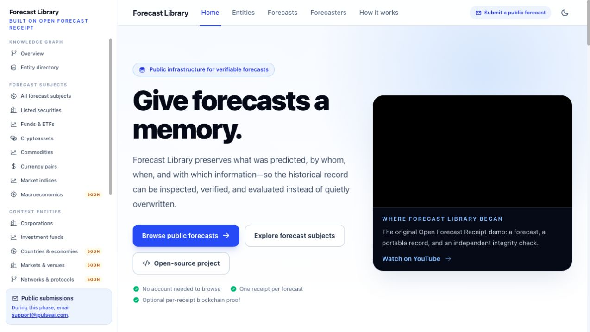
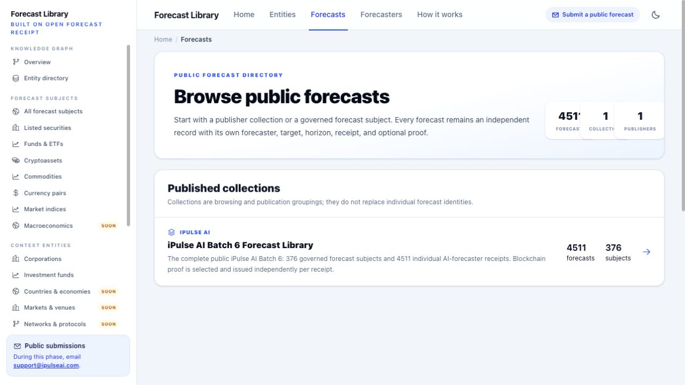
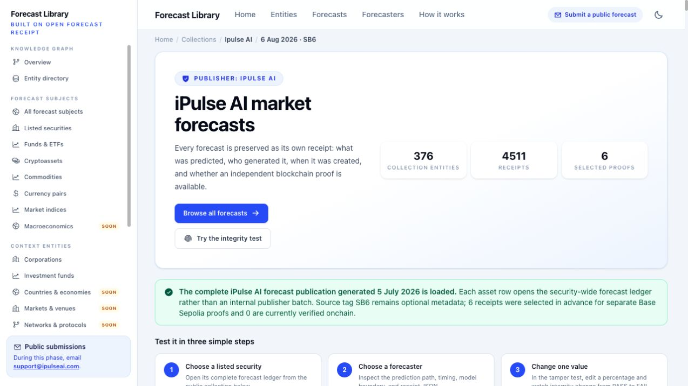
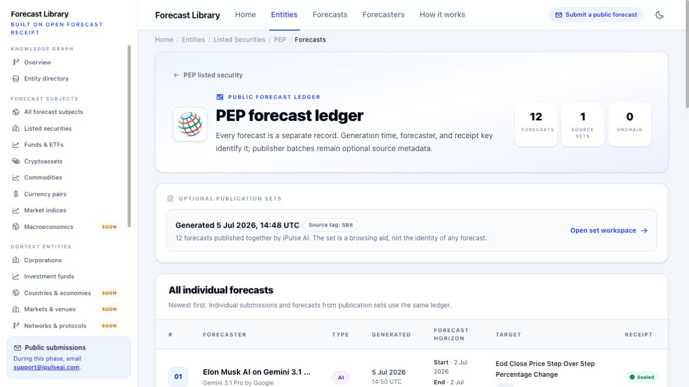
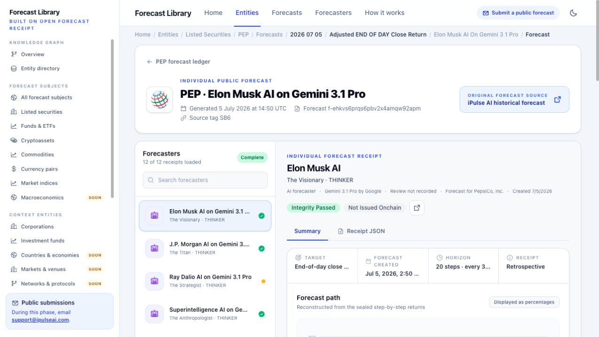
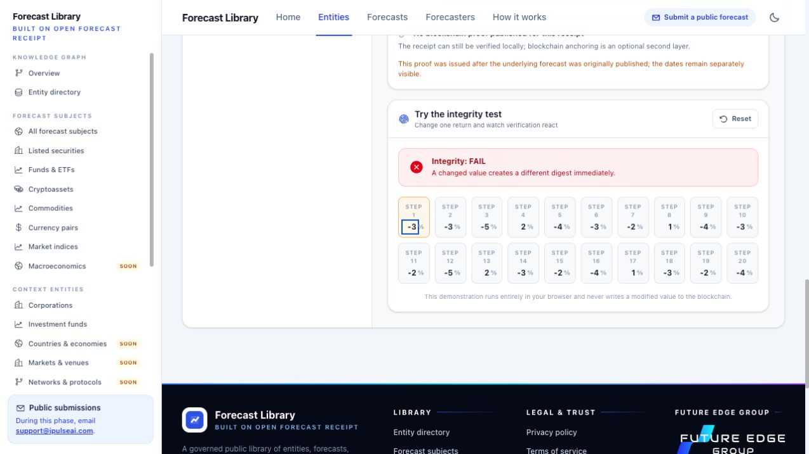
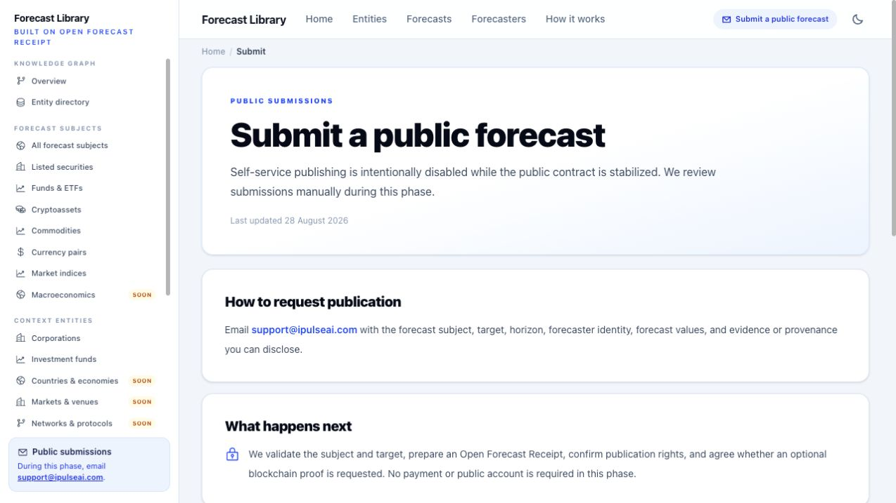
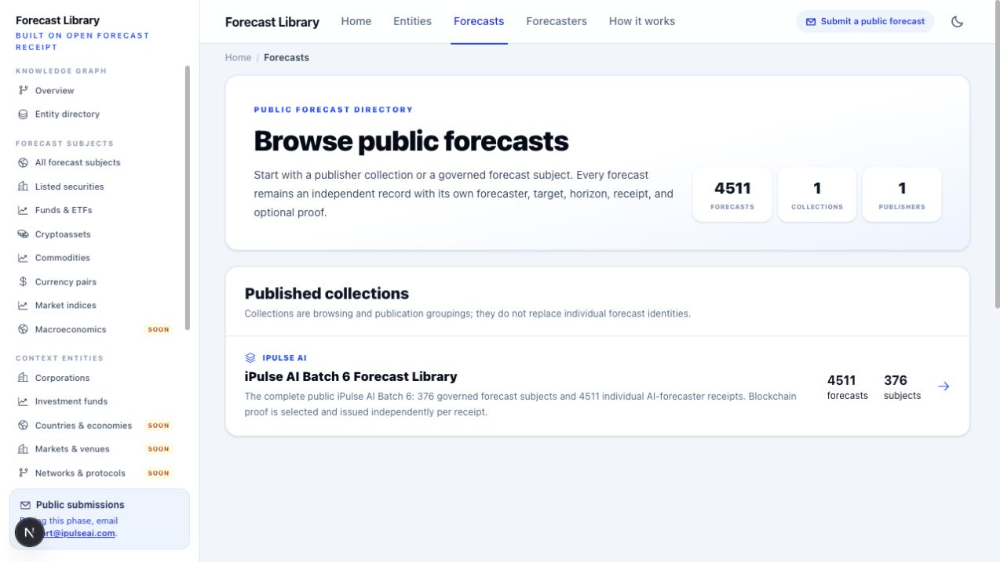
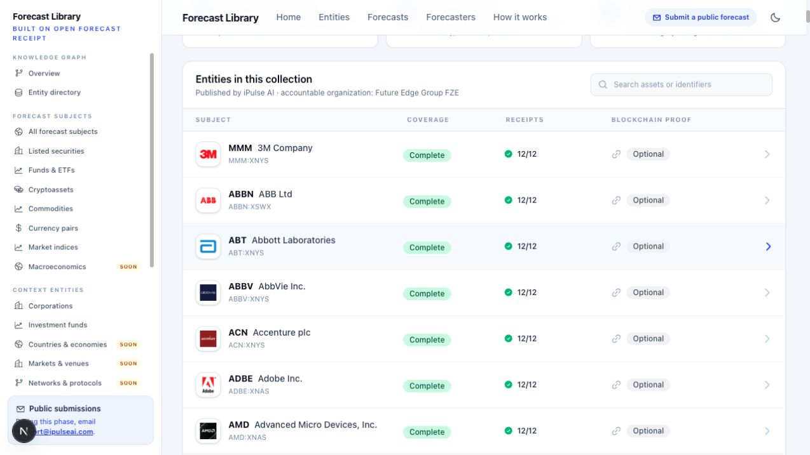
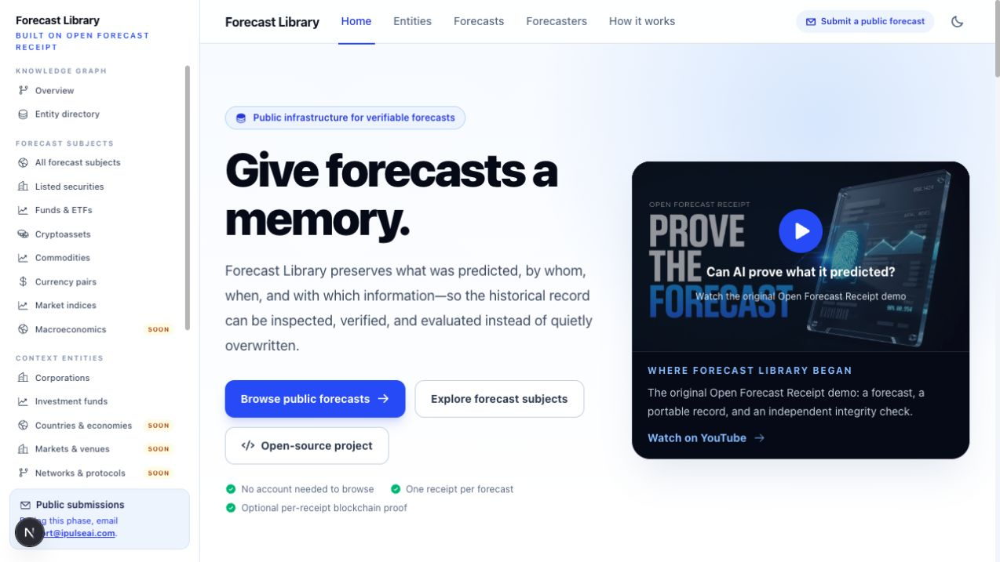

# Forecast Library: product, architecture and marketability audit

Audit date: 2026-09-08 UTC. Product: https://forecastlibrary.com.
Repository: TheFutureEdge/open-forecast-receipt, main.
Baseline HEAD: 5e3458a633d63ad01241af0308c30b2639876429.
Status: audit completed; corrective changes are local, tested, and not deployed.

## Decision

Keep the product and Firestore. Position the first release as a curated public
forecast evidence library for research teams and agent developers. Do not start
broad promotion as a general publishing platform, accuracy leaderboard, or
working A2A service yet.

The core idea is coherent: preserve a precise prediction, its origin, its time
boundaries, and its integrity so somebody else can inspect it later. The current
implementation demonstrates this with substantial real data and a useful tamper
test. Its limitations are in publication governance, revision storage, growing
catalogs, onboarding, and evaluation. A wholesale database replacement or early
microservice split would not address those problems efficiently.

The earlier launch audit established that Batch 6 and the website could be
served. It did not establish that arbitrary publishers, corrections, forecast
types, or large sustained workloads were supported. This audit supersedes any
broader interpretation of "fully ready."

## Evidence and limits

- Live production journey captured in the in-app browser: landing, directory,
  collection, PepsiCo ledger, individual forecast, tamper test, submission page.
- Read-only production catalog plan: 5,700 lightweight source documents,
  14,679 proposed writes, zero actual writes, zero receipt payload scans.
- Production: 4,511 forecasts and receipts; 376 forecast subjects; 802 public
  entities; eight forecaster profiles; one publisher, target and collection.
  There are 375 subjects with 12 forecasts and QQQ with 11. Six receipts are
  selected for optional proof; zero are issued/verified.
- Controlled synthetic, resealed fixtures reproduced admission and proof-state
  problems without sending any synthetic record to Firestore. Before/after
  evidence is saved beside the screenshots.
- Source inspection covered publishers, canonicalization and verification,
  schema, rules, indexes, server reads, routing, catalog materialization,
  deployment configuration, and public content.
- Final local validation: 79 tests in 13 files, 28 readiness checks, TypeScript
  and production build passed. Local browser verification used an isolated
  preview with staging reads; it did not alter staging data.
- Ordinary HTTPS checks now return 200 for the apex and 200 after the www
  redirect. Earlier propagation failures are resolved in this audit's checks.

This is an engineering/product review, not a penetration-test certificate,
full WCAG assessment, load-test result, legal opinion, or evidence of market
demand. Mobile breakpoints and a complete keyboard/screen-reader journey were
not exercised. No customer interviews, conversion analytics, restore exercise,
or paid willingness-to-pay experiment were available. No production data,
rules, indexes, billing controls, or service configuration changed in this
audit.

## What works and should be preserved

1. The brand/domain is Forecast Library; Open Forecast Receipt is the underlying
   open-source standard. The YouTube origins story connects these appropriately.
2. Subject, target, forecaster, publisher, receipt and collection are distinct
   concepts. Governed entities distinguish economic subjects and context.
3. Canonical payload hashes and the client tamper test demonstrate integrity.
   In the observed forecast, changing step one from -4% to -3% changed the
   edited document's result from PASS to FAIL, without a database write.
4. Forecast knowledge/input/execution times and retrospective issuance are
   visible. Source links and downloadable evidence make the record inspectable.
5. Sealed receipts already have content-addressed IDs. Published URLs have
   resolver layers. Both are useful foundations for additive evolution.
6. Firestore readers use compact catalogs and receipt point reads. Ledger and
   sitemap parts already have size bounds. The production web identity is a
   reader, separate from controlled publishers; browsers cannot write records.
7. Public browsing requires no account or payment. Optional blockchain proof
   is correctly a separate product concept from forecast accuracy.

## Findings and disposition

P0 means block new uncontrolled publication; P1 means resolve before broad
marketing or the indicated expansion; P2 means improve during a curated beta.
"Fixed locally" does not mean the live service has changed.

| ID | Priority and observed problem | Disposition and remaining work |
| --- | --- | --- |
| F01 | P0: a schema-valid private/restricted or draft receipt could enter public namespaces through the controlled publisher. Public point-read rules do not inspect those flags. | Fixed locally: explicit public admission and draft/withdrawn rejection. Regression tests cover both visibility and lifecycle. No evidence of a live private-data leak was found. Keep all drafts/private material outside public namespaces. |
| F02 | P0 before publisher two: a foreign issuer was silently attributed to the hardcoded iPulse AI publisher. | Fixed locally: reject mismatched issuer. This is a safe single-publisher adapter, not multi-publisher support. Add governed publisher registration, ownership and namespaced source IDs before onboarding another issuer. |
| F03 | P0 before corrections: public IDs include revision identity, but `public_forecasts/{sourceForecastId}` could be overwritten by a later revision, making old resolvers lead to new evidence. | Guarded locally: reject identity/digest/revision replacement before opening the bulk writer; existing writes carry last-update preconditions and new identities use create. Readers verify public-ID/digest bindings. Full immutable revision storage remains necessary. |
| F04 | P1: merely supplying an attestation UID set index/proof status to verified and incremented verified counts. | Fixed locally: an unverified reference is pending, never counted as verified. UI distinguishes reference from verified proof. A trusted verification/reconciliation worker with durable observations is still required before issuing/promoting proofs. |
| F05 | P1: catalog writes discarded individual BulkWriter promises. A successful `close()` alone does not establish that every operation succeeded. Cleanup could precede confirmation of replacement writes. | Fixed locally: collect outcomes, fail on any rejected write/delete, and only start cleanup after all replacements succeed. Failure tests added. In-place generations can still be partially visible; atomic generation activation is the structural solution. |
| F06 | P1 before repeated releases: materialization scans all current source indexes and writes 14,679 documents for the present dataset. Multiple catalogs remain monolithic. | Measured, not fixed structurally. Partition all growing catalogs, separate projection work from authoritative index maintenance, and publish complete generations through one pointer. Add incremental rebuilds after correctness is established. |
| F07 | P1: no field exemptions for sealed payloads or large embedded catalog arrays/maps. | Ten local field exemptions prepared; existing composite indexes retained. Deploy and verify them separately. No Firestore index changes were applied during this audit. |
| F08 | P1: a well-shaped unknown forecast ID returned HTTP 500; receipt resolver misses also threw instead of returning absence. | Fixed locally: unknown records return absence/404 while database failures still propagate. Tests cover missing documents, database errors and resolver mismatch. |
| F09 | P1 for developer promotion: the schema's published `$id`, `https://ipulseai.com/schemas/open-forecast-receipt/v0.1.0/schema.json`, returned HTTP 404. | Outstanding cross-site repair: serve the exact frozen schema at that address. Add a versioned Forecast Library mirror/discovery document. Do not change sealed receipts or rewrite v0.1 `$id` just to repair hosting. |
| F10 | P1 before generalization: v0.1 requires market/path and acquisition-specific structure; current publishers and routes also assume iPulse and listed securities. | Preserve v0.1. Implement a neutral v0.2 core plus typed prediction/domain/provenance profiles. A binary human forecast must not require invented market or web-search fields. |
| F11 | P1 before evaluation claims: forecaster version/config/run references are mostly metadata; immutable execution/version records and outcome/evaluation records are not implemented. | Add those records with explicit unknown states and versioned resolution contracts. Do not advertise comparable accuracy or independent-model diversity on eight persona profiles using the same underlying model. |
| F12 | P1 operational gap: production point-in-time recovery is disabled; delete protection is enabled. Backup/restore readiness, budget alerts and uptime/error alerts were not established by this audit. | Define recovery objectives; enable the selected recovery mechanism and perform a restore rehearsal before reliance grows. Verify alerts and an owner response path. Max two app instances is not a Firestore spend cap. |
| F13 | P1 conversion: directory metrics overlapped; collection's primary browse link returned visitors to the general directory instead of its subject list; an intermediate forecast breadcrumb was not a real route. | Fixed locally: nonshrinking metrics, correct same-page fragment, fragment-aware Link, no invalid breadcrumb, wrapping breadcrumbs. Local screenshots confirm directory and collection fixes. |
| F14 | P1 clarity: the video appeared as an empty dark player in the audit browser; proof copy implied an issued proof even when none existed; indexes were described as loaded receipts. | Fixed locally: clickable thumbnail/title before loading YouTube, direct watch fallback retained, accurate retrospective receipt language and "forecast records available." Full third-party playback is not guaranteed in restricted browsers. |
| F15 | P1 market experience: forecast meaning appears below dense provenance/navigation; All public forecasts first shows one collection; many SOON categories compete with live content. | Remaining product redesign: prediction-first record header, direct example journey, filterable forecast discovery, compact primary navigation with advanced ontology available secondarily. |
| F16 | P1 publisher conversion: Submit is manual email, with no complete integration quickstart or submission-status workflow. | Suitable for an explicitly curated beta. Before expansion add a downloadable validated example, acceptance criteria, rights declaration, response expectation and publication preview. Do not add authentication/payment merely for appearance. |

Evidence for F01-F04 is in
[before probes](../design-qa-artifacts/product-audit-2026-09-08/publication-probes-before.json)
and [after probes](../design-qa-artifacts/product-audit-2026-09-08/publication-probes-after.json).
The after probe still shows the planner's legacy storage key: the new write
preflight blocks a replacement rather than pretending a revision migration has
already happened. This distinction is intentional.

## Observed user journey and proposed improvement

| Step | Current experience | Health and next change |
| --- | --- | --- |
| 1. Understand | Home explains preservation, integrity and origins. | Good concept; add a clear "Inspect one forecast" path and keep current versus planned capabilities explicit. Video fallback fixed locally. |
| 2. Browse | Forecasts opens a publisher collection directory. | Extra indirection; show a few real predictions and filters, with collections as another entry point. Layout fixed locally. |
| 3. Select subject | Collection lists 376 subjects below a long introduction. | Browse jump fixed locally. Move search nearer the top; replace repeated hackathon/showcase framing with consistent curated-beta wording. |
| 4. Select forecast | PepsiCo ledger presents 12 records with broad provenance columns. | Functional but dense. Expose target, horizon, predicted value, generation time, forecaster mode and evaluation state before secondary metadata. |
| 5. Inspect | Selected forecast has a large header/sidebar before the substantive prediction. | Reorder to prediction, timing, integrity, then expandable provenance. Preserve all evidence; reduce the initial cognitive load. |
| 6. Verify | Tampering visibly fails; original and edited records remain distinct. | Strong demonstration. Explain "matches this sealed payload" separately from trusted timestamp, issuer identity and outcome accuracy. |
| 7. Contribute | Email-based manual review. | Honest but incomplete onboarding. Offer a copyable example and an explicit review process before attracting external publishers. |

In the inspected PepsiCo record the initial price is USD 144.22, the terminal
forecast USD 89.21, and the displayed total change -38.14% across 20 quarterly
steps through July 2031. These are the forecast's contents, not observed
performance. Show such concrete content above the fold. Distinguish persona
mode (for example THINKER versus RESEARCHER) from independent model identity;
make clear that named AI personas are not statements by their human namesakes.

Screenshots 01-07 are live production; 08-10 are the local corrected preview.
All were captured during this audit, saved and visually inspected.

## Target product and module boundaries

Keep one repository and a modular application initially. Separate responsibilities
in code before separating deployable services:

| Module | Responsibility | Must not depend on |
| --- | --- | --- |
| OFR Core | Versioned schema validation, canonicalization, digest verification, compatibility vectors | Firebase, AI providers, iPulse, a blockchain network |
| Profiles and adapters | Prediction-type contracts, domain semantics, iPulse import mapping, optional A2A mapping | Website presentation assumptions |
| Registry and publication | Publisher authority, idempotency, immutable identities, admission, release manifests and provenance | A particular publisher's source IDs being globally unique |
| Projections and evaluation | Rebuildable browse catalogs; separately versioned outcome and scoring jobs | Editing an original receipt to add a result |
| Web and API | Human browsing, JSON access, documentation, caches and public discovery | Direct access to private submission storage |

Extract a distributable OFR Core package when two independent consumers need it.
Keep the existing Next.js app and Firestore for the present operational workload.
Use object storage for oversized evidence only when required, with content
digests and durable availability policies. Introduce an analytical store for
cross-population scoring when those queries exist. Do not adopt a graph database
solely because the UI describes a knowledge graph; current identity links do not
demonstrate a need for complex graph traversal infrastructure.

## Proposed Firestore model: additive, not a description of live storage

The [current structure](FORECAST_LIBRARY_FIRESTORE_STRUCTURE.md) documents what
exists today. The following is the recommended next model. Names are proposed;
none of these new namespaces was created in this audit.

| Record | Identity and content | Mutation/access contract |
| --- | --- | --- |
| `publishers/{publisherId}` | Accountable organization, domain evidence, allowed adapters, status | Privileged governance; approved public projection only |
| `workspaces/{workspaceId}/submissions/{submissionId}` | Candidate payload, submitter, rights declaration, review state, validation report | Private, tenant-scoped; never placed under `public_*` while pending |
| `forecast_series/{seriesId}` | Publisher, stable source forecast key, subject/target, current revision pointer | Series key namespaced by publisher; pointer updates transactionally |
| `forecast_revisions/{revisionId}` | Immutable public ID, series ID, source revision key, receipt digest, previous revision ID, correction reason, forecaster/run/target versions | Create-only; unique publisher/source/revision identity; no arrays of growing history |
| `receipts/{digest}` | Frozen canonical receipt bytes/document, spec/profile versions, size, storage reference if needed | Content-addressed and immutable; public copy only after explicit admission |
| `forecasters/{forecasterId}` and `forecaster_versions/{versionId}` | Stable identity plus immutable model/persona/configuration snapshot | Human, model, agent, ensemble and hybrid types; version does not change with display-name edits |
| `execution_runs/{runId}` | Forecaster version, published tool/config references, observed execution times, parent run and artifact references | Sanitized immutable run snapshot; explicit unknown fields, no fabricated provenance |
| `targets/{targetId}` and `target_versions/{versionId}` | Measurement, units, horizon convention, outcome source, resolution policy and scoring eligibility | Immutable target semantics per version; human-readable slug is an alias |
| Existing entity identity/version records | Subject identity and dated identifiers/relationships | Reuse governed entity system; role and class need not be fixed by a URL category |
| `collections/{collectionId}/members/{revisionId}` | Curation membership, publisher/curator and display order | Collections are optional, many-to-many; a forecast can exist without Batch 6 or any batch |
| `outcome_observations/{observationId}` | Target version, observation period/value, source artifact/hash, observed/fetched times, revision lineage | Append-only observations; revised data does not rewrite an earlier observation |
| `evaluations/{evaluationId}` | Forecast revision, observation ID, scoring-rule/version, horizon, eligibility, result, evaluatedAt | Immutable evaluation; reruns are idempotent, rule/data changes create new versions |
| `proof_verifications/{verificationId}` | Digest, network, attestation UID, issuer/schema checks, chain observation, result and checkedAt | Append-only verification observations; revocation/reorg can change current derived status |
| `publication_events/{eventId}` | Submitted, accepted, published, corrected, withdrawn decisions with actor/reason and references | Append-only audit; moderation is independent of mathematical validity |
| `catalog_generations/{generationId}/...` | Versioned, partitioned public read models and counts/checksums | Write complete generation, validate, then activate; readers pin one generation |
| `public_catalog_state/current` | Active generation ID, previous generation, schema version, activation time | Single atomic pointer switch with compare-and-set and rollback |
| Existing public resolvers | Stable legacy ID/digest/path to exact immutable revision | Preserve old URLs and digest bindings; do not reassign identifiers |

Private canonical records above would be accessed through controlled IAM and
server authorization. Public projections remain deliberately readable. Firestore
rules are not a substitute for admission policy: Admin SDK readers bypass them.
Avoid storing a private flag on a publicly readable document and expecting it to
hide the contents. Withdrawal removes the record from discovery and serves an
appropriate public tombstone; restricted content must also be removed from public
payload access and caches according to a defined policy. Preserving evidence
history does not require permanently exposing mistakenly published private data.

### Generalized receipt contract

Version 0.2 should contain a neutral envelope: receipt/revision identity, issuer,
subject, target version, forecaster version, generation and knowledge boundaries,
typed prediction, provenance references, disclosure, integrity and lineage.
Profiles should express paths, binary probabilities, categorical distributions,
point estimates and quantiles with their own validation rules. Domain profiles
define units and resolution semantics; agent provenance is optional.

Maintain separate forecast generation, receipt creation, public publication,
trusted anchoring, outcome observation and evaluation timestamps. A digest alone
does not prove who created a forecast or when they created it. A retrospective
anchor cannot establish existence at the original generation date. Never infer
unknown model/tool behavior from a convenient fallback label.

Resolution must be defined when the forecast is made: data source, time zone,
market calendar, adjusted/unadjusted price rule, currency, corporate-action
handling, missing data, revisions and cancellation. For probability questions,
specify the exact event and ambiguous/void resolution policy. An outcome and a
score are separate objects, so scoring methods can evolve without rewriting
evidence. Comparable cohorts must share target semantics, information windows
and scoring rules.

### Expansion acceptance tests

1. Two publishers both submit source ID `42`: distinct series, revisions and
   public identities; no shared mutable record or attribution collision.
2. A forecast is corrected: old public URL and digest return the original,
   current series points to the correction, and both show lineage.
3. One forecast belongs to two collections: one receipt and revision, two
   memberships; counts distinguish forecasts from memberships.
4. A human submits a binary non-market forecast: no invented model, market,
   retrieval or path fields are required.
5. An agent run uses several tools/models: service identity, execution graph
   and forecaster identity remain distinct; secrets and private reasoning are
   excluded from public provenance.
6. Outcome data is revised or a proof is revoked: new observation/verification
   records update derived views, preserving earlier evidence.
7. An importer fails midway: active public generation remains complete and
   internally consistent; retry is idempotent.
8. A published item is withdrawn: discovery, resolver/tombstone policy, payload
   accessibility and cached responses follow one tested governance decision.

## Scale and operating model

Current measured sizes are serialized JSON estimates, not exact billed Firestore
storage or a load test. The application ceiling is 665,600 bytes (650 KiB).

| Read model | Largest current document | Consequence |
| --- | ---: | --- |
| Entity directory | 328,683 bytes | Already about half the application ceiling; partition before assuming entity growth is unlimited |
| Collection catalog | 187,058 bytes | Growing embedded members eventually hit the cap; use manifest plus pages |
| Entity ledger part | 26,418 bytes | Already partitioned; preserve bounded pagination |
| Forecaster catalog | 14,390 bytes | Small now, but one growing document is not a long-term catalog contract |
| Sitemap part | 665,427 bytes | Near the application cap by design; it is already sharded, so this is not itself a launch failure |

Firestore documents have a 1 MiB maximum and index-entry limits. Large maps and
arrays should not be automatically indexed when no query needs them. The local
index exemptions address payload/catalog fanout; fields used for filters and
ordering remain intentional indexes. [Firestore limits](https://firebase.google.com/docs/firestore/quotas),
[Firestore best practices](https://firebase.google.com/docs/firestore/best-practices).

A full current rebuild costs 5,700 source reads and schedules 14,679 writes even
without changing a receipt. Repeating it daily would schedule 440,370 writes in
30 days before growth, retries or user traffic. This is operation arithmetic,
not a price estimate. Browsing costs also depend on cache misses and page counts.
Instrument actual reads per route, payload bytes, cache hit rate, p95 latency,
publication duration, failed jobs and stale-generation age before selecting a
price/performance target.

The next materializer should create a generation with bounded parts, count and
digest checks, then switch the active pointer. Preserve the prior generation
for rollback; garbage collection follows a retention policy after activation.
Use publisher/release idempotency keys and compare-and-set pointers. Rebuild only
affected partitions once a full deterministic rebuild is correct. Do not put
all forecasts into a single transaction or continuously update a global count
document on every event.

Before larger ingestion, test at least 10x the current record count plus an
unevenly popular subject, multiple publishers, large payloads, concurrency,
partial failures and rollbacks. Validate pagination without duplicates or gaps,
correct totals, stable URLs and bounded reads. Recovery acceptance requires an
actual restore and receipt-digest comparison, not merely a backup setting.

## Agent interoperability

The current receipt JSON API is a useful artifact endpoint; it is not an A2A
implementation. Build a documented, versioned read contract first: receipt
fetch, forecast discovery with cursors, schema discovery, consistent error
responses, ETags and examples. Add authenticated, idempotent publishing only
after publisher governance exists.

Then map supported agent tasks to the same domain model. An agent service card
describes the service, while forecaster/run records describe who produced the
prediction. Task artifacts should reference durable receipt URLs and digests.
Advertise only implemented skills and security mechanisms. A2A describes agent
discovery, tasks and artifacts; it does not supply the forecast's resolution
contract or make its output true. [A2A specification](https://a2a-protocol.org/latest/specification/).

## Marketability and commercial direction

Recommended positioning: **Forecast Library is a public evidence library for
forecasts, built on Open Forecast Receipt, so research teams and agents can
publish, verify and revisit exactly what was predicted.**

The first audience is research teams and agent developers who already produce
forecasts and struggle to preserve a reproducible record across tools. The
initial job is to create and inspect durable evidence with little integration
work. A general investor audience would expect timely discovery and trustworthy
performance comparison that the current product does not yet provide.

| Adjacent offering | What its primary materials establish | Implication for Forecast Library |
| --- | --- | --- |
| Metaculus | Question forecasting and defined scoring methods. [Scoring FAQ](https://www.metaculus.com/help/scores-faq/) | Do not compete initially on community size or scoring maturity; make exported evidence interoperable where permitted. |
| ForecastBench | A dynamic forecasting benchmark with a defined evaluation methodology. [Documentation](https://www.forecastbench.org/docs/) | A collection of forecasts is not itself a comparable benchmark. Build resolution and cohort rules before performance claims. |
| Ethereum Attestation Service | General attestation infrastructure. [Documentation](https://docs.attest.org/) | Optional anchoring is an infrastructure layer; differentiated value must come from forecast semantics, usability and evidence continuity. |

These comparisons establish adjacent capabilities, not market share or demand
for this product. Their data/API terms also require independent checking before
integration; open access does not imply unrestricted commercial redistribution.

The strongest differentiators to prove are: portable evidence outside one host,
clear time boundaries, explicit correction lineage, forecaster/run identity,
and eventual outcome linkage. Hashing alone is easy to reproduce. Long-term
defensibility would come from trusted publisher integrations, useful longitudinal
records, reliable resolution and a format that other tools actually adopt.

Keep public reading and local verification free. Test paid hosted publishing,
private/team workflows, API service commitments, integrations and retention
only with teams that need them. Avoid a token/pay-per-attestation business model
as the default; blockchain is optional. Do not promise SLAs before the operating
model supports them. Separate code license, submitted-content license and
underlying-data redistribution rights in onboarding and public documentation.

### Proposed validation plan, not measured results

Run a small curated pilot before a broad campaign. Recruit directly only with
owner approval; no outreach was sent in this audit.

- Interview ten qualified research/agent teams about an actual recent forecast
  handoff or audit. Look for recurring evidence-loss problems and an existing
  workaround, not abstract enthusiasm.
- Have five users unfamiliar with the app find a forecast, explain its value,
  timing and integrity status, and retrieve its JSON. Proposed gate: four of
  five succeed without help within two minutes; nobody confuses integrity PASS
  with proven accuracy.
- Onboard two independent publishers using the same documented contract.
  Proposed gate: both publish a valid first record without a bespoke schema fork
  and at least one publishes again within 30 days.
- Give an external developer the quickstart. Proposed gate: retrieve and verify
  one receipt within 15 minutes, without founder assistance or hidden credentials.
- Track successful independent verification/reuse, repeat publishers, time to
  first valid publication, resolution coverage and repeat research use. Total
  receipt count and page views alone are weak success measures.
- Explore paid needs through concrete workflow commitments or pilot proposals.
  No revenue forecast, demand score or willingness-to-pay result is claimed.

## Sequenced release gates

### Gate A: credible curated public beta

Promote the tested local safeguards and UI corrections through the repository's
release process. Apply and verify the index exemptions. Repair the frozen schema
URL on iPulse AI, exercise real missing-route HTTP responses after deployment,
verify recovery/alerting ownership, complete mobile/keyboard checks and deliver
a usable example-led quickstart. Keep manual admission and clearly label the
current single-publisher scope. A2A and evaluation stay explicitly planned.

### Gate B: second publisher or first correction workflow

Implement publisher namespaces, immutable revision records, forecaster/target
versions, explicit private submission boundaries and additive compatibility
resolvers. Execute expansion tests 1-4 and 8. No external ingestion before
authority, rights and admission are enforceable.

### Gate C: repeated releases, evaluation and broader adoption

Implement generation activation, partition remaining catalogs, exercise failure
and load cases, then introduce incremental materialization. Add resolution and
evaluation records before any accuracy dashboard. Add a service/API integration
only after two independent consumers validate the contract.

### Migration invariants

Export and checksum the existing dataset before a migration. Backfill new
revision/version references without changing sealed v0.1 bytes. Shadow-build
new catalogs and compare every current digest, public ID and canonical route.
Preserve the existing long forecast URLs and receipt API; any simpler future
route requires the documented URL-governance process and compatibility redirects.
Switch a generation only after validation, retain rollback, and keep historical
staging receipts. Batch 6's published collection slug is `2026-08-06-sb6`; the
underlying forecasts were generated on 5 July. Those are different dates, not a
reason to rename a published URL.

The immediate local patch materially reduces risk. It does not complete Gates
B/C, fix the externally hosted schema URL, enable backups, or prove commercial
fit. Those remaining items are explicit product work, not hidden assumptions
behind a "ready" label.
