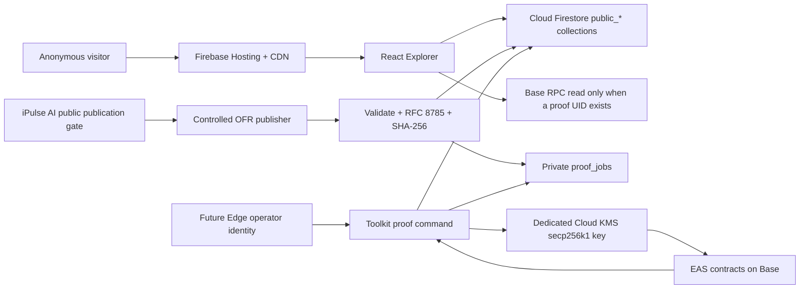

# Open Forecast Library architecture v0.2

Date: 2026-08-12  
Status: active lean architecture  
Scope: Future Edge-operated, public iPulse AI showcase; no customer accounts or payments  
Fixed infrastructure target: less than USD 9 per month

## 1. Decision

Open Forecast Library is now the public database and browsing product around the
Open Forecast Receipt standard. The first version is deliberately small:

- public, anonymous, read-only browsing;
- controlled publication of sanitized iPulse AI receipts by Future Edge;
- outside submission requests through `support@ipulseai.com`;
- optional per-receipt Ethereum Attestation Service proofs on Base;
- no customer accounts, private storage, billing, Stripe, SQL Connect, or
  always-on backend.

Use Firebase Hosting plus Cloud Firestore Standard. Static JSON files remain
only as canonical test vectors and controlled import sources. They are not the
runtime database.

## 2. Product boundaries

| Layer | Purpose | Persistence or wallet ownership |
|---|---|---|
| Open Forecast Receipt | JSON contract for one immutable forecast, provenance, correction lineage, and proof envelope | None |
| Open Forecast Toolkit | Validate, canonicalize, hash, encode, verify, import, and publish | Accepts a signer interface; never stores a key |
| Open Forecast Explorer | Human-readable receipt, chart, JSON, proof, and tamper views | Read-only |
| Open Forecast Library | Firestore catalog of collections, subjects, forecasters, forecasts, receipts, proofs, and private operator jobs | Owns the public database and managed proof workflow |
| iPulse AI adapter | Maps approved iPulse AI forecasts to OFR | Runs after iPulse AI's immutable publication gate |

The current repository is a lean monorepo for all five layers. A second
repository is unnecessary until the Library becomes an independently deployed
multi-tenant product.

## 3. Current implementation

The local application now reads Firestore through
`src/lib/library/repository.ts`. The reviewed Batch 6 sources are imported by
`scripts/seed-firestore.mjs` into:

- 5 stable subjects;
- 8 public AI forecasters/personas;
- 60 forecast index records;
- 60 full Open Forecast Receipt records;
- 6 private proof jobs chosen by the declared showcase selection rule.

The controlled staging import requires `--apply` and
`OFR_CONFIRM_FIRESTORE_PROJECT=<exact-project-id>`. It creates documents
without overwriting existing receipts. Local UI work reads staging through the
same anonymous, read-only client path used after deployment; no Firebase
emulator is started.

The public web client has no write method and cannot access proof jobs.

## 4. Runtime topology



There is no public application server. Anonymous reads go directly from the
Firebase Web SDK to Firestore under Security Rules. Controlled publishing uses
the Admin SDK and Google Cloud IAM, which bypasses client rules by design.

## 5. Firebase project isolation

The already-published hackathon site `open-forecast-receipt.web.app` is a
secondary Hosting site in `ftredge-staging`. It is not in a PAPP project, but it
should remain a historical/demo deployment.

Create dedicated projects before any cloud Firestore import:

| Environment | Proposed project ID | Display name | Chain |
|---|---|---|---|
| staging | `oflapp-staging` | OFLAPP-STAGING | Base Sepolia |
| production | `oflapp-prod` | OFLAPP-PROD | Base mainnet only after separate approval |

Never reuse `ipulse-401013`, `pulse-staging-e1394`, or
`pulseapp-firebase-dev`. The Library also gets separate service accounts, KMS
keys, budgets, rules, Hosting sites, and wallet addresses per environment.

## 6. Firestore model

Public and private namespaces are deliberately separate. This makes anonymous
queries simple and prevents Security Rules from being mistaken for result
filters.

### Public collections

| Collection | Document ID | Purpose |
|---|---|---|
| `public_collections` | stable collection ID, for example `batch-6` | Publication metadata and aggregate counts |
| `public_collection_subjects` | `{collectionId}__{stableSlug}` | Subject membership, display snapshot, ordering, and proof counts |
| `public_subjects` | stable subject ID | Enduring subject identity, aliases, and current identifiers |
| `public_forecasters` | stable forecaster ID | Human, AI model, algorithm, ensemble, hybrid, or organization identity |
| `public_forecasts` | stable forecast ID | Lightweight searchable index pointing to a receipt digest |
| `public_receipts` | lowercase SHA-256 payload digest | Full immutable OFR document and compact proof projection |
| `public_proofs` | `{caip2}__{attestationUid}` | Verified proof metadata and receipt pointer |

`public_receipts` permits direct `get` only, not collection scans. Discovery
uses `public_forecasts`; a receipt opens by its digest. This reduces accidental
bulk transfer of the large receipt documents.

### Private operator collections

| Collection | Purpose |
|---|---|
| `proof_jobs` | Selected receipt, target network, status, attempts, and retry metadata |
| `publisher_runs` | Import audit record and source digests |
| `operator_locks` | Optional short-lived idempotency and nonce coordination |

All client access to private collections is denied. They are available only to
least-privilege Google IAM identities through server libraries.

### Immutability

- A receipt document ID is its SHA-256 payload digest.
- Production imports use create-only writes.
- Adding a proof updates only proof metadata or inserts `public_proofs`; it does
  not change the sealed `receiptPayload` digest.
- A correction creates a new receipt with an explicit lineage reference.
- Stable subject IDs are never tickers. Ticker, MIC, ISIN, and other identifiers
  are point-in-time attributes and aliases.
- Firestore's 1 MiB document limit is enforced with a 900,000-byte publisher
  guard. Current OFR documents are far below it.

## 7. Firestore access control

`firestore.rules` applies this policy:

- anonymous read of explicitly named `public_*` catalog collections;
- direct anonymous read of a public receipt by digest;
- no public receipt collection scan;
- no browser write, including from a signed-in Firebase user;
- deny everything else.

Future Edge operators do not need Firebase customer accounts. They authenticate
to Google Cloud and receive a narrow IAM role for the controlled publisher.
This is simpler and safer than adding Firebase Authentication just to manage an
internal publishing process.

## 8. Forecast publication lifecycle

1. iPulse AI completes a forecast and reaches its immutable public-publication
   gate.
2. The adapter exports only approved public fields. Raw prompts, raw model
   responses, private evidence, credentials, and hidden chain-of-thought never
   enter OFR.
3. The Toolkit maps one individual forecast to one `receiptPayload`.
4. JSON Schema validation passes.
5. RFC 8785 canonicalization and SHA-256 produce the receipt digest.
6. The publisher checks stable subject and forecaster identity, correction
   lineage, duplicate digest, timestamps, and Firestore document size.
7. A create-only operation writes the public subject/forecast/receipt records.
8. If the selection policy requests an onchain proof, the publisher creates a
   private `proof_jobs` record.
9. The Library becomes immediately browsable; blockchain proof is optional and
   may still show `not_issued`.
10. After confirmation on Base, proof metadata is added and the iPulse AI batch
    ledger can link directly to the Library receipt and EAS explorer.

The blockchain timestamp never replaces the forecast creation time. Batch 6 is
retrospective and remains labeled as such.

## 9. Blockchain implementation

### What is integrated

The Toolkit uses `viem` to call the standard Ethereum Attestation Service
contracts deployed on Base:

- Schema Registry: `0x4200000000000000000000000000000000000020`
- EAS: `0x4200000000000000000000000000000000000021`
- Base Sepolia chain ID: `84532`

There is no special “Base storage SDK.” Base is an EVM layer-2 network. `viem`
encodes the EAS contract call, estimates it, signs the Ethereum transaction,
submits it to a Base RPC endpoint, waits for confirmation, and reads each EAS
attestation back.

One receipt remains one EAS UID. `multiAttest` may transport several receipts
in one transaction, but it does not merge their identities or proof records.

### Gas payment

Gas is paid in ETH held by the dedicated Library attester address. The public
visitor and iPulse AI do not attach wallets. Funding flow:

```text
Russlan's personal wallet
  -> small ETH transfer
  -> dedicated Library attester address
  -> EAS transaction gas on Base
```

Do not send 10 ETH. That would create unnecessary loss exposure. For testnet,
use faucet Base Sepolia ETH. For Base mainnet, start only after a live estimate
and fund a small operational amount such as `0.005-0.02 ETH`, then top up when
the balance falls below a defined threshold. The transaction command must stop
if its estimated total fee exceeds the approved USD 5 batch ceiling.

Base transaction cost has an L2 execution component and an L1 data-security
component, so the final preflight must estimate the total Base fee, not only
`gas × gasPrice`.

### Wallet and key security

Use two unrelated wallets:

- staging/Testnet attester: disposable, Base Sepolia only, no mainnet funds;
- production attester: generated inside production Cloud KMS and never exported.

The production key specification is:

```text
purpose: ASYMMETRIC_SIGN
algorithm: EC_SIGN_SECP256K1_SHA256
protection: SOFTWARE
```

Google Cloud KMS supports using a same-length Keccak-256 digest with its ECDSA
signing operation, which is what Ethereum transactions require. A Toolkit KMS
adapter converts the DER signature to Ethereum `r`, `s`, and recovery parity,
verifies the recovered address against the expected attester, and only then
broadcasts the raw transaction.

No private key appears in GitHub, Firestore, a receipt, browser storage, log
output, or `.env`. The operator/service account gets only:

- `cloudkms.cryptoKeyVersions.useToSign` on one exact key version;
- `cloudkms.cryptoKeyVersions.viewPublicKey` on that key;
- narrow Firestore access to proof jobs and proof updates;
- no permission to create or destroy keys.

Cloud Audit Logs record KMS signing. The command verifies the chain ID, EAS
contract address, schema UID, selected receipt digests, signer address, balance,
nonce, and fee ceiling before signing.

The existing `.env.local` private-key path remains testnet-only compatibility
for the six-receipt pilot. It is not the production design.

## 10. Cost model

| Component | Design | Expected fixed monthly cost |
|---|---|---:|
| Firebase Hosting | Static React build and CDN | USD 0 within 10 GB storage/transfer free allowances |
| Firestore Standard | One database per environment | USD 0 within 1 GiB, 50k reads/day, 20k writes/day, 10 GiB outbound/month |
| Authentication | None for visitors; Google IAM for operators | USD 0 |
| Compute | Maintainer-run publisher/proof command; no always-on service | USD 0 |
| Cloud KMS production key | One software secp256k1 key version | about USD 0.06/month plus USD 0.03 per 10k cryptographic operations |
| Base Sepolia gas | Faucet test ETH | USD 0 monetary cost |
| Base mainnet gas | Per approved proof batch | Variable; hard cap USD 5 per batch |
| SQL Connect / Cloud SQL | Not used | USD 0 |

Expected fixed cost is approximately USD 0-0.06 per environment at current
showcase scale, safely below USD 9. Blockchain gas is explicit variable usage,
not fixed infrastructure.

Set billing budgets and alerts at USD 5 and USD 9. Google budgets are alerts,
not automatic caps; code-level fee and usage gates are still required.

## 11. Staging-backed development and testing

Put the public Firebase Web configuration for `oflapp-staging` in
`.env.staging.local`, then run Vite:

```bash
npm run dev -- --host 127.0.0.1
```

Open:

- Library showcase: `http://127.0.0.1:5173/showcase`
- Fast integrity test: `http://127.0.0.1:5173/test`

Verification:

```bash
npm test
npm run build
npm audit --omit=dev
npm run eas:preflight
```

The browser remains read-only under deployed Firestore Security Rules. Cloud
imports require the exact project confirmation environment variable and Admin
SDK identity.

## 12. What is complete and what still requires approval

Complete locally:

- Firestore runtime repository;
- 145-record controlled Batch 6 seed (including 60 receipts and 6 proof jobs);
- anonymous public-read/client-deny-write rules;
- direct receipt links and Library browsing;
- read-only public client and controlled cloud import workflow;
- deterministic EAS encoding, preflight, testnet issuance, and chain verifier.

Not performed:

- production project/database activation and deployment;
- any cloud Firestore import or deployment;
- Cloud KMS key creation or IAM grants;
- EAS schema registration or receipt issuance;
- Base mainnet activation;
- iPulse AI ledger code changes.

Those are separate external-state steps and require exact staging/production
approval. The next safe milestone is to provision staging, deploy Firestore
rules, import the 60 receipts, then issue the six selected proofs on Base
Sepolia and sync their individual UIDs.
