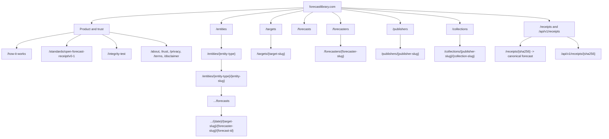

# Forecast Library URL and Domain Governance v1

Individual-record routing is superseded by
`PERMANENT_RECORDS_AND_PUBLISHER_BOUNDARIES_2026-09-09.md`: published URLs serve
their original evidence directly, without per-record redirect dependencies.

**Status:** Product name and canonical domain approved; route contract remains the production-launch gate
**Date:** 2026-08-28
**Scope:** Public domain, canonical URLs, entity and forecast permalinks, redirects, indexing, sitemaps, and cross-linking with iPulse AI
**Decision owner:** Future Edge Group FZE

## Executive decision

Do not launch or create reciprocal links from iPulse AI while the public canonical host is a Firebase `hosted.app` or `web.app` address.

The registered permanent public origin is:

```text
https://forecastlibrary.com
```

Recommended supporting domains and hosts:

```text
https://www.forecastlibrary.com      -> permanent redirect to the apex domain
https://openforecastlibrary.com      -> exact-brand defensive registration and permanent redirect, if purchased
https://forecastlibrary.org          -> optional defensive registration and permanent redirect, if purchased
current Firebase hosted.app host     -> staging only, noindex, no public backlinks
production Firebase default host     -> permanent host-level redirect to the canonical domain
```

Future Edge Group acquired `forecastlibrary.com` on 2026-08-28. DNS ownership,
Firebase App Hosting attachment, certificate provisioning, canonical metadata,
and redirects must still be verified before production launch.

The dedicated `.com` is preferable to an iPulse AI subdomain because Forecast Library is intended to support many domains, publishers, organizations, humans, AI systems, and quantitative models. It should have an independent identity even though iPulse AI is its first publisher and Future Edge Group operates both products.

## Approval summary

Approval of this document means approving these seven decisions:

1. Use the product name **Forecast Library**. “Open Forecast Receipt” remains the open-source standard, schema, verifier, and toolkit beneath the product. “Ledger” remains a page-level term for a chronological list of forecasts.
2. Use the registered `forecastlibrary.com` domain as the production canonical origin.
3. Keep all Firebase-owned domains out of production canonical tags, public backlinks, and production sitemaps.
4. Simplify entity catalogs to `/entities/{entity-type}` and entity pages to `/entities/{entity-type}/{immutable-public-slug}`.
5. Keep individual forecasts under their governed subject, but add the target and a stable public forecast ID to the route.
6. Make `/receipts/{sha256}` a resolver that redirects to the one canonical forecast page; expose receipt JSON through a versioned API rather than a duplicate HTML page.
7. Replace publisher-specific “batch” routes with optional, separate `/collections` pages. A collection groups forecasts but does not identify them.

No production deployment should occur until these decisions are implemented and the prelaunch checklist at the end passes.

## Why the domain must be decided before production

Firebase App Hosting supports custom apex domains and subdomains and provisions SSL certificates for them. The hosting provider can therefore change later without changing public URLs, as long as the custom domain is used from day one.

Launching on `hosted.app` and moving later would create an avoidable Google site migration. Google supports site moves, and permanent redirects preserve ranking signals, but the move still requires redirects, updated internal and external links, new sitemaps, Search Console work, and recrawling. A permanent custom domain avoids that entire class of work.

### Domain option assessment

| Option | Advantages | Material disadvantages | Verdict |
|---|---|---|---|
| `forecastlibrary.com` | Short, memorable, easy to type and say; exact match to the product name; independent across publishers and forecast domains; suitable for a commercial company | None material | **Registered canonical origin** |
| `openforecastlibrary.com` | Useful defensive variant | Longer and not the product name | Buy defensively only if inexpensive; redirect to `forecastlibrary.com` |
| `forecastlibrary.org` or `openforecastlibrary.org` | Strong open-infrastructure signal | Can suggest a nonprofit identity even though Future Edge Group is a commercial company | Optional defensive registrations only |
| `library.ipulseai.com` | Quick to configure; visibly connected to the first publisher | Makes a cross-publisher library appear to be an iPulse AI feature; a later spin-out requires a domain migration | Accept only if it will be permanent; not recommended |
| `ipulseai.com/open-forecast-library` | Shares the iPulse AI root domain and authority | Strongest product coupling; awkward for third-party publishers; not independently portable | Not recommended for the Library |
| Firebase `hosted.app` or `web.app` | No domain purchase or DNS setup | Provider-owned branding; weak product identity; inevitable migration if the product succeeds | Staging and fallback infrastructure only |
| `.ai` domain | Recognizable AI association | Forecast Library also supports humans and quantitative models; higher renewal cost; unnecessarily narrows the concept | Not recommended |

### Canonical host policy

Production must have exactly one public origin:

```text
https://forecastlibrary.com
```

Every other production host must issue a server-side permanent redirect while preserving path and query string:

```text
http://forecastlibrary.com/x             -> https://forecastlibrary.com/x
https://www.forecastlibrary.com/x        -> https://forecastlibrary.com/x
https://openforecastlibrary.com/x        -> https://forecastlibrary.com/x, if purchased
https://forecastlibrary.org/x            -> https://forecastlibrary.com/x, if purchased
https://<production>.hosted.app/x        -> https://forecastlibrary.com/x
https://<production>.web.app/x           -> https://forecastlibrary.com/x
https://open-forecast-receipt.web.app/x  -> https://forecastlibrary.com/x, where that legacy hackathon host is controllable
```

The production build must fail if `NEXT_PUBLIC_SITE_ORIGIN` is absent, invalid, or a Firebase-owned host. The current `https://oflapp-prod.web.app` fallback must be removed before production.

Staging remains on its current Firebase App Hosting URL. It must not redirect to production. It should be protected by authentication if practical; otherwise every staging HTML response must carry `noindex, nofollow` in both metadata and an `X-Robots-Tag`. Staging must never appear in a sitemap or receive public backlinks. Robots rules alone are not an indexing control because crawlers must be able to retrieve a page to see its `noindex` rule.

## URL design principles

All public routes follow these rules:

- HTTPS only.
- Lowercase ASCII path segments.
- Hyphens between words; no underscores in human-readable slugs.
- No trailing slash, except the root `/`.
- No `.html` or implementation-specific extensions for HTML pages.
- A governed object has one canonical HTML URL.
- Query parameters represent transient browsing state, never object identity.
- Fragments may scroll within a page, but never identify a forecaster, receipt, or other independently discoverable object.
- Display names, ticker symbols, and model labels may change; public slugs never change after publication.
- Unknown objects return a real server `404`; intentionally withdrawn URLs may return `410`.
- Moved URLs issue server-side `308` or `301` redirects before any page renders. Client-side replacement is not a canonicalization strategy.
- URL aliases are governed data. They are not guessed from the current display name on every request.

Google recommends simple, descriptive, human-readable URLs and hyphens between words. It also treats permanent redirects as a stronger canonical signal than canonical tags or sitemap inclusion.

## Final route hierarchy



## Canonical route contract

### Product, protocol, and trust

| Purpose | Canonical route | Notes |
|---|---|---|
| Landing page | `/` | Explains the Library and links into the major directories |
| Mission/company | `/about` | Operator, mission, governance, and Future Edge Group attribution |
| Concept and architecture | `/how-it-works` | Human explanation, diagrams, Knowledge Graph, receipt lifecycle |
| Standards index | `/standards` | Lists published and draft standards |
| OFR specification | `/standards/open-forecast-receipt/v0-1` | Versioned; a future `v0-2` gets a new URL |
| Integrity test | `/integrity-test` | Interactive tamper-detection demonstration |
| Trust center | `/trust` | Proof limitations, governance, corrections, security, evaluation policy |
| Legal pages | `/privacy`, `/terms`, `/disclaimer` | Stable legal routes |

The current `/standards` page mixes product explanation and standard material. Before production, the visual explanation should become `/how-it-works`; `/standards` should become an index, and the normative OFR contract should have a versioned child URL.

### Entity catalogs and details

Use one predictable pattern for both catalogs and details:

```text
/entities
/entities/{entity-type}
/entities/{entity-type}/{entity-slug}
```

Initial governed entity types:

```text
listed-securities
corporations
investment-funds
cryptoassets
commodities
currency-pairs
market-indices
economic-indicators
benchmark-rates
countries
markets-venues
networks-protocols
```

Examples:

```text
/entities
/entities/listed-securities
/entities/listed-securities/3m-mmm
/entities/corporations
/entities/corporations/3m-company
/entities/investment-funds
/entities/cryptoassets/bitcoin
```

The subject/context distinction remains an important Knowledge Graph role and navigation grouping, but it should not produce an extra URL layer. A corporation can be context for a listed security and a forecast subject in another forecast. Roles can evolve; governed entity type is the more stable URL classification.

Therefore the current catalog routes should be simplified:

```text
/entities/directory                          -> /entities
/entities/subjects/listed-securities         -> /entities/listed-securities
/entities/subjects/funds-etfs                -> /entities/listed-securities?category=funds-etfs
/entities/subjects/cryptoassets              -> /entities/cryptoassets
/entities/subjects/commodities               -> /entities/commodities
/entities/subjects/currency-pairs            -> /entities/currency-pairs
/entities/subjects/market-indices             -> /entities/market-indices
/entities/subjects/macroeconomics             -> /entities/economic-indicators
/entities/context/corporations               -> /entities/corporations
/entities/context/investment-funds           -> /entities/investment-funds
/entities/context/countries                  -> /entities/countries
/entities/context/markets-venues             -> /entities/markets-venues
/entities/context/networks-protocols         -> /entities/networks-protocols
```

Filtered query URLs are useful UI state but are not separate indexable pages unless a curated category has enough unique explanatory content to justify a landing page. Filtered pages should either canonicalize to the collection route or be explicitly `noindex,follow`.

### Entity slug governance

The current readable slugs can remain, provided they become immutable governed fields.

Examples:

```text
3m-mmm
abbott-laboratories-abt
alibaba-ordinary-shares-9988
alibaba-adr-baba
3m-company
```

Rules:

1. `publicSlug` is assigned once when an entity is first published.
2. It is stored in the semantic entity registry and copied to public catalogs.
3. It is never recomputed automatically from a new company name or ticker.
4. Name, ticker, MIC, venue, and other identifiers remain mutable entity properties.
5. Renames and ticker changes update visible data, not the canonical URL.
6. Old or alternate names and tickers are stored in `urlAliases` and issue permanent redirects.
7. New collisions are disambiguated at first publication with a stable contextual term such as ticker, MIC, country, or instrument class.
8. A slug can never be reassigned to a different governed entity.

This keeps URLs readable without exposing UUIDs and keeps a Meta/Facebook-style ticker change from breaking the route.

### Forecast directories and ledgers

Targets are governed objects too. Reserve a first-class target directory even if the first production UI exposes only a small number of target definitions:

```text
/targets
/targets/{target-slug}
```

Examples:

```text
/targets/adjusted-end-of-day-close-return
/targets/real-gdp-growth
/targets/federal-funds-target-rate
```

A global target page defines the measurement, dimension, unit, cadence rules, and compatible subject classes. The individual forecast route below still records the target slug so a forecast permalink remains understandable without relying on page state.

```text
/forecasts
/entities/{entity-type}/{entity-slug}/forecasts
```

`/forecasts` is the global public forecast directory. It must not be titled or structured as an iPulse-only page even while iPulse AI is the only publisher. Publisher is a filter and a governed relationship.

The entity ledger contains every individual public forecast for that entity, regardless of whether it came from a batch, collection, or individual submission.

Examples:

```text
/forecasts
/entities/listed-securities/3m-mmm/forecasts
/entities/cryptoassets/bitcoin/forecasts
/entities/economic-indicators/us-real-gdp-growth/forecasts
```

### Individual forecast permalink

Recommended canonical shape:

```text
/entities/{entity-type}/{entity-slug}/forecasts/{generated-date}/{target-slug}/{forecaster-slug}/{forecast-public-id}
```

Example:

```text
/entities/listed-securities/3m-mmm/forecasts/2026-07-05/adjusted-eod-close-return/elon-musk-ai-gemini-3-1-pro/f-01k2m7k7j5a2c6m5k6q8v4x9pt
```

Why each segment exists:

| Segment | Purpose | Identity rule |
|---|---|---|
| `listed-securities/3m-mmm` | Governed forecast subject | Immutable entity `publicSlug` |
| `2026-07-05` | Human-readable UTC generation date | Frozen from the sealed issuance time |
| `adjusted-eod-close-return` | Governed target definition | Frozen target public slug |
| `elon-musk-ai-gemini-3-1-pro` | Human-readable forecaster profile | Frozen public forecaster slug; the model is part of this AI forecaster profile |
| `f-...` | Authoritative globally unique forecast locator | Stable public ID; labels before it are descriptive |

The current full timestamp segment is unnecessary once the public ID is authoritative. A date is more readable, while exact issuance time remains visible in the receipt and structured data.

The current first 16 hexadecimal characters of the receipt digest should not remain the permanent global forecast ID. It provides only 64 bits and also couples forecast identity to one receipt digest. Instead:

- Add `forecastPublicId` to the forecast index.
- Derive existing Batch 6 IDs deterministically from `publisherId + sourceForecastId + sourceRevisionId` using a namespaced UUID or equivalent 128-bit identifier.
- Encode the 128-bit value as lowercase Crockford Base32 with an `f-` prefix.
- Generate a new ID for every independent forecast or append-only correction.
- Store `correctsForecastId` and `correctsReceiptDigest` for corrections rather than replacing an old record.
- Keep source forecast IDs as provenance, not public route values.

If any descriptive segment does not match the resolved `forecastPublicId`, the server must issue a permanent redirect to the canonical route. This permits robust alias handling without serving duplicate pages.

### Forecasters

```text
/forecasters
/forecasters/{forecaster-slug}
```

Examples:

```text
/forecasters/elon-musk-ai-gemini-3-1-pro
/forecasters/ray-dalio-ai-gemini-3-1-pro
```

Fragments such as `/forecasters#forecaster-...` must not identify profiles. Google generally does not treat fragments as separately crawlable pages, and a fragment cannot carry independent metadata, canonical tags, breadcrumbs, or structured data.

For an AI forecaster, the model implementation is part of the governed profile, as previously agreed. A materially different model implementation is a different forecaster profile, not a silent update to an existing identity. Minor profile description changes do not change the immutable slug.

### Publishers and collections

Reserve these namespaces now even if the first release exposes only iPulse AI:

```text
/publishers
/publishers/{publisher-slug}
/collections
/collections/{publisher-slug}/{collection-slug}
/collections/{publisher-slug}/{collection-slug}/entities/{entity-slug}
```

Examples:

```text
/publishers/ipulse-ai
/collections/ipulse-ai/2026-07-05-sb6
/collections/ipulse-ai/2026-07-05-sb6/entities/3m-mmm
```

`SB6` may be retained as an iPulse source tag, but “batch” must not lead a canonical URL. A third-party individual submission has no collection and still receives an ordinary forecast permalink.

The current entity-scoped `/forecast-sets/...` route should move to `/collections/...`. No individual forecast is canonicalized under a collection.

### Receipts and machine access

There must be one canonical HTML page for an individual forecast. That page already contains its chart, summary, complete receipt, integrity result, provenance, and optional blockchain proof.

Use the receipt digest as a durable resolver and machine identifier:

```text
/receipts/{64-character-sha256}
/api/v1/receipts/{64-character-sha256}
```

Behavior:

- `/receipts/{digest}` performs one resolver lookup and issues a permanent redirect to the canonical forecast page, optionally with `#receipt` for user positioning.
- `/api/v1/receipts/{digest}` returns the canonical sealed JSON receipt with `Content-Type: application/json`.
- The individual forecast page provides “Receipt JSON” and “Download JSON” controls without creating a second indexable HTML document.
- A receipt resolver record stores `receiptDigest`, `forecastPublicId`, and `canonicalPath` outside the sealed receipt payload.
- If a receipt cannot be mapped to a public forecast, the resolver returns `404`; private receipts are never disclosed by enumeration.

This removes the current duplicate where `/receipts/{digest}` and the individual forecast page render materially the same receipt as two HTML pages.

## Current implementation audit

| Current behavior | Risk | Required pre-production change |
|---|---|---|
| Production origin falls back to `oflapp-prod.web.app` | Provider domain can become canonical accidentally | Require the custom origin and fail production build otherwise |
| `/receipts/{digest}` returns a second HTML receipt page | Duplicate content and unclear “Open full receipt” action | Convert to resolver; add versioned JSON API |
| Forecast key is the first 16 digest characters | Long-term collision and forecast/receipt identity coupling | Add a 128-bit `forecastPublicId` |
| Forecast path includes a full timestamp but no target | Less readable and omits a central object in the data model | Use UTC date + target slug + stable forecast ID |
| `/entities/{legacy-id-or-slug}` returns `200` and redirects only in the browser | Duplicate/soft canonical route | Resolve and redirect on the server before rendering |
| Forecaster profiles use fragments under an old `/entities/forecasters` route | Not independently crawlable; no profile metadata | Add `/forecasters/{slug}` pages and server redirects |
| Arbitrary `/manifest/{id}` pages still render | Publisher jargon leaks into public URL identity | Retire manifests as HTML; use `/collections` |
| `/forecasts` is titled as iPulse AI-only | Prevents the global library model from scaling | Make it the global forecast directory; publisher is data/filter |
| `/entities` and `/entities/directory` have overlapping meanings | Competing directory entry points | Make `/entities` the one directory |
| Catalog paths include `/subjects` and `/context`, but detail paths do not | Unnecessary hierarchy and user confusion | Use `/entities/{entity-type}` for both catalog and detail |
| Sitemap lists static and entity pages only | Forecast and forecaster pages may be discovered slowly | Add sharded canonical sitemaps |
| Staging uses both robots disallow and page `noindex` | A crawler blocked by robots cannot read `noindex` | Prefer access control or crawlable `noindex`; never link publicly |
| Legacy UI links still target `/manifest/batch-6`, `/entities/forecasters`, and receipt HTML | Redirect chains and obsolete information architecture | Update all internal links directly to final routes |

## Redirect and alias policy

Because the product has not formally launched, most staging-only paths can simply be removed. Preserve redirects only for URLs already exposed through the hackathon, shared reports, videos, or other real external links.

Minimum redirect map:

```text
/manifest/batch-6
  -> /collections/ipulse-ai/2026-07-05-sb6

/manifest/{collection}/assets/{entity}
  -> /collections/{publisher}/{collection}/entities/{entity}

/assets/{entity}
  -> /entities/listed-securities/{entity}/forecasts

/entities/directory
  -> /entities

/entities/subjects/{type}
  -> /entities/{type}

/entities/context/{type}
  -> /entities/{type}

/entities/forecasters#forecaster-{id}
  -> resolver-backed /forecasters/{slug}

/entities/{legacy-entity-id-or-slug}
  -> resolver-backed /entities/{entity-type}/{entity-slug}

/receipts/{digest}
  -> resolver-backed canonical forecast URL

current staging forecast permalink shape
  -> resolver-backed final forecast permalink
```

Maintain domain-move redirects for at least one year after a public migration; permanent product aliases should be kept indefinitely when inexpensive. Redirect directly to the final URL—never through chains.

Create two governed resolver collections:

```text
public_url_aliases/{sha256(oldPath)}
  oldPath
  canonicalPath
  objectType
  objectId
  redirectCode
  createdAt
  reason

public_receipt_resolvers/{receiptDigest}
  receiptDigest
  forecastPublicId
  canonicalPath
  visibility
  createdAt
```

These resolver documents are small, cheap, and avoid scanning forecast or receipt collections on every legacy request.

## Canonical, indexing, and pagination rules

### Canonical tags

- Every `200` HTML page emits one absolute canonical URL on `forecastlibrary.com`.
- Redirecting or `404` URLs do not emit self-canonicals.
- All Open Graph URLs match the canonical URL.
- Structured data uses the canonical production URL in `@id`, `url`, and breadcrumbs.
- The Firebase host never appears in production HTML, JSON-LD, sitemap files, social cards, or outbound campaign links.

### Pagination and filters

- Use crawlable page URLs such as `?page=2` for public HTML pagination.
- Each real pagination page is self-canonical because it contains a different set of records.
- Firestore cursors stay internal and must not become permanent public query values.
- Provide ordinary `<a href>` previous/next links; do not depend only on buttons or JavaScript.
- Search, sort, and filter combinations are `noindex,follow` and canonicalize to the unfiltered collection unless a curated category landing page exists.
- Never canonicalize every pagination page to page 1; that would hide deeper entity and forecast links.

### Sitemaps

Use a sitemap index and content-type shards from launch:

```text
/sitemap.xml
/sitemaps/static-1.xml
/sitemaps/entities-1.xml
/sitemaps/targets-1.xml
/sitemaps/forecasters-1.xml
/sitemaps/publishers-1.xml
/sitemaps/collections-1.xml
/sitemaps/forecasts-1.xml
/sitemaps/forecasts-2.xml
```

Rules:

- Include only canonical, public, indexable `200` URLs.
- Never include redirect sources, API endpoints, receipt resolvers, staging URLs, filtered query URLs, or private records.
- Add entity detail, target detail, forecaster detail, publisher, collection, entity ledger, and individual forecast pages.
- Use the actual meaningful update timestamp for `lastmod`.
- Shard before 50,000 URLs or 50 MB uncompressed; target 40,000 URLs per shard for operational margin.
- Keep stable shard boundaries so Search Console performance can be reviewed by object type.

### Breadcrumbs

Visible breadcrumbs and `BreadcrumbList` JSON-LD should describe the user hierarchy rather than mechanically repeating every URL segment.

Example forecast breadcrumb:

```text
Home > Entities > Listed securities > 3M (MMM) > Forecasts > Elon Musk AI forecast
```

Example collection breadcrumb:

```text
Home > Collections > iPulse AI > 5 July 2026 set
```

## Structured identity and cross-linking

Each canonical entity page should expose:

- the stable Forecast Library entity `@id` on the canonical domain;
- the appropriate Schema.org type where one exists;
- `sameAs` links to verified Wikidata, Wikipedia, official websites, and other governed identifiers;
- links to related entities using visible anchor text;
- forecast ledgers and targets as explicit relationships.

Each forecast page should link visibly to:

- its governed subject;
- its target definition;
- its forecaster profile;
- its publisher profile;
- its optional collection;
- its original iPulse AI historical source when applicable;
- its receipt JSON and optional blockchain proof.

## iPulse AI backlink timing

Do **not** add reciprocal iPulse AI links yet.

The correct sequence is:

1. Confirm the product name and approve this URL contract. **Done: Forecast Library.**
2. Register the canonical domain. **Done: `forecastlibrary.com`.**
3. Connect it to the production App Hosting backend.
4. Implement canonical host enforcement and the final route/redirect contract.
5. Deploy production with no public promotion.
6. Verify headers, canonicals, structured data, redirects, sitemap shards, and `robots.txt` on the custom domain.
7. Add the custom domain to Google Search Console and submit the sitemap index.
8. Only then add iPulse AI historical-page links to the Forecast Library canonical forecast pages.
9. Keep Forecast Library's “original forecast source” links back to the matching iPulse AI historical pages, creating clean contextual two-way navigation.

The first iPulse AI links should never point to staging or Firebase-owned domains. Otherwise they create external references that must be migrated immediately.

## Pre-production implementation sequence

1. Use the acquired `forecastlibrary.com` domain; optionally register `openforecastlibrary.com` and the `.org` variants defensively.
2. Add `forecastPublicId`, immutable target slugs, immutable forecaster slugs, and receipt resolver records to the public data contract.
3. Implement the final route helpers and tests before changing UI links.
4. Convert untyped entity routes, staging forecast routes, receipt routes, manifest routes, and fragment profiles into server redirects.
5. Create real forecaster, publisher, collection, and standards routes.
6. Replace every internal link with its final canonical target to eliminate redirect chains.
7. Split product explanation from the versioned OFR specification.
8. Replace the production-origin fallback with a mandatory custom-origin assertion.
9. Enforce the canonical host at the server edge/application boundary.
10. Build sitemap index and shards from Firestore catalogs rather than reading thousands of individual documents per request.
11. Add resolver and route-contract tests, including ticker changes, company renames, duplicate slugs, corrected forecasts, and old receipt links.
12. Deploy to staging and crawl it locally/externally while it remains `noindex`.
13. After approval of the resulting crawl report, deploy production on the custom domain.

## Production launch gate

Production is approved only when every item is true:

- [x] `forecastlibrary.com` is registered and controlled by Future Edge Group FZE.
- [ ] DNS and Firebase App Hosting custom-domain verification are complete.
- [ ] HTTPS is valid on apex and redirect hosts.
- [ ] Production fails closed if the canonical origin is missing or provider-owned.
- [ ] `www`, `.org` if owned, `hosted.app`, and `web.app` redirect path-for-path to the apex domain.
- [ ] All canonical HTML routes return `200` server-rendered content.
- [ ] Every legacy/exposed URL returns one direct permanent redirect or a true `404/410`.
- [ ] No client-only canonical redirects remain.
- [ ] Entity slugs, target slugs, forecaster slugs, and forecast public IDs are persisted governed fields.
- [ ] No individual forecast has more than one indexable HTML page.
- [ ] `/receipts/{digest}` resolves; `/api/v1/receipts/{digest}` returns JSON.
- [ ] No public route or page title exposes iPulse “batch” as the forecast identity.
- [ ] Canonicals, Open Graph URLs, JSON-LD IDs, and sitemap URLs use the custom domain.
- [ ] Sitemap index includes entities, ledgers, forecasts, forecasters, publishers, and collections.
- [ ] Staging is absent from sitemaps and public links and remains `noindex`.
- [ ] Desktop and mobile navigation use crawlable anchor links.
- [ ] Google Rich Results Test validates breadcrumbs and applicable structured data.
- [ ] A crawl finds no redirect chains, duplicate titles, broken internal links, soft 404s, or orphan forecast pages.
- [ ] Only after all checks pass are reciprocal iPulse AI links added.

## Primary references

- [Google: URL structure best practices](https://developers.google.com/search/docs/crawling-indexing/url-structure)
- [Google: Canonicalization and duplicate URLs](https://developers.google.com/search/docs/crawling-indexing/canonicalization)
- [Google: How to specify a canonical URL](https://developers.google.com/search/docs/crawling-indexing/consolidate-duplicate-urls)
- [Google: Site moves with URL changes](https://developers.google.com/search/docs/crawling-indexing/site-move-with-url-changes)
- [Google: Site moves without URL changes](https://developers.google.com/search/docs/crawling-indexing/site-move-no-url-changes)
- [Google: Build and submit a sitemap](https://developers.google.com/search/docs/crawling-indexing/sitemaps/build-sitemap)
- [Google: Robots meta and X-Robots-Tag](https://developers.google.com/search/docs/crawling-indexing/robots-meta-tag)
- [Google: Breadcrumb structured data](https://developers.google.com/search/docs/appearance/structured-data/breadcrumb)
- [Firebase App Hosting: Custom domains](https://firebase.google.com/docs/app-hosting/custom-domain)
- [Firebase App Hosting overview](https://firebase.google.com/docs/app-hosting)

## Final recommendation

Approve the dedicated-domain approach and treat this as a final prelaunch route refactor, not as a post-launch migration. The current staging site is technically useful, but its URL contract is not yet production-final because entity catalogs are split across two hierarchies, forecasts use a truncated receipt digest, forecasters use fragments, collection jargon remains in routes, and receipt HTML is duplicated.

After this contract is implemented, the architecture can scale from the current iPulse AI Batch 6 records to independent forecasts, many publishers, non-market domains, corrected forecasts, millions of receipt permalinks, and multiple hosting backends without changing the public identity of existing records.
